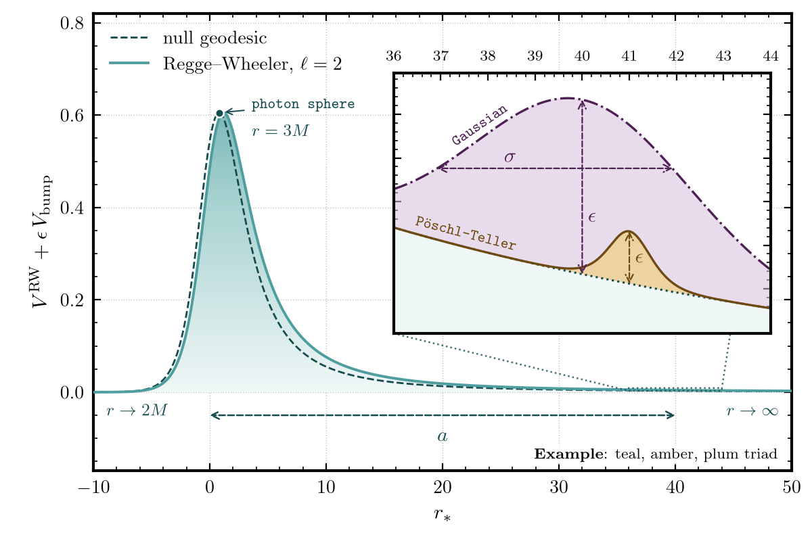
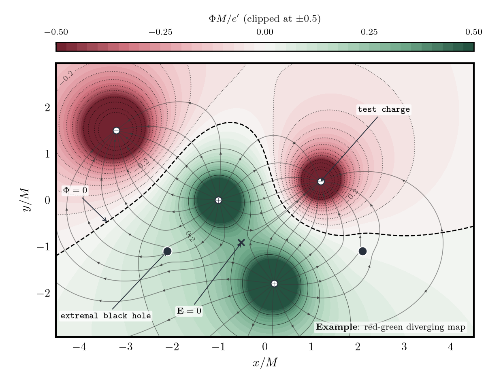
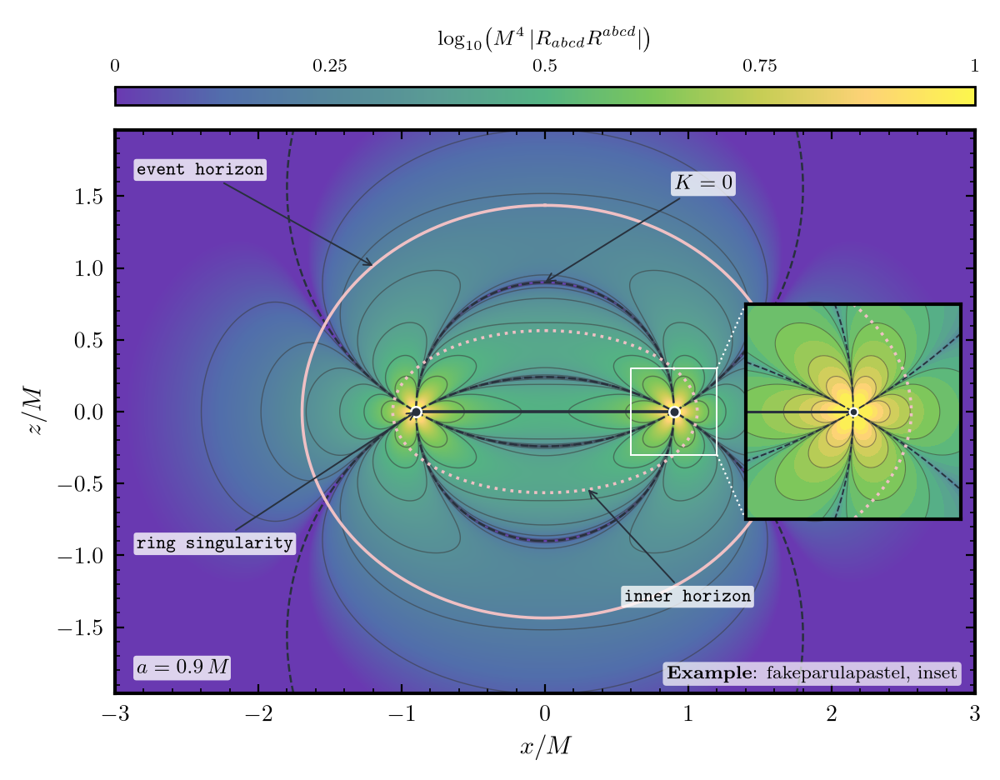
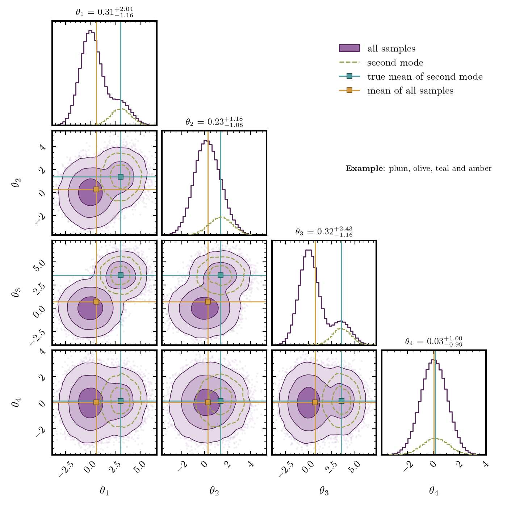
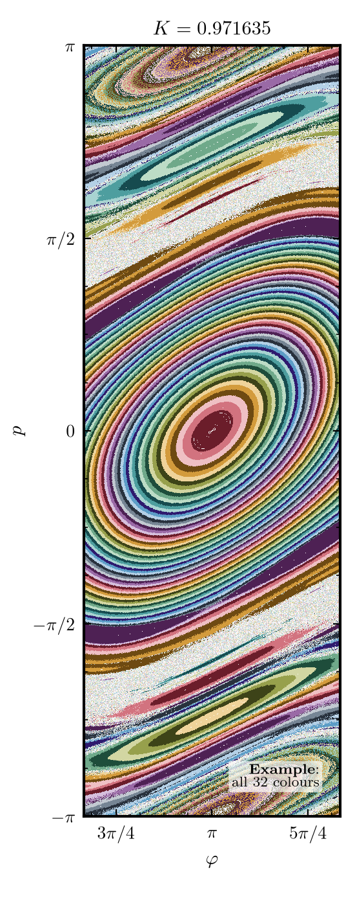
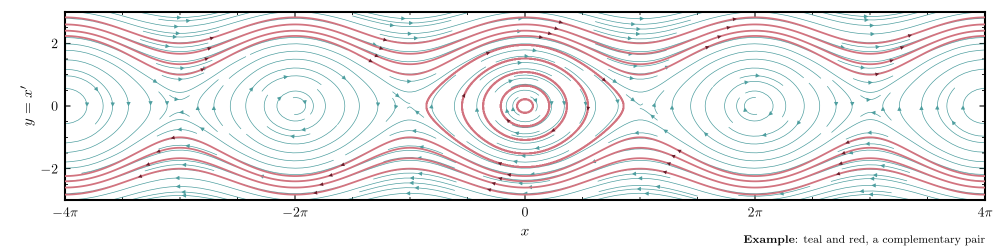

# amore

An opinionated matplotlib plot style that I developed it over the past few years while working on the figures in my work. It has LaTeX text, a heavy frame, inside ticks, 32 muted colours in 8 palettes, colour
maps built from them, and small helpers for shaded bands, insets, colour bars and saving.

<p align="center">
  
  
</p>
<p align="center">
  
  
</p>

<p align="center">
  
  
</p>

<p align="center">
  
</p>

The 32 colours, with their hex codes and lightness:

<p align="center">
  
</p>

## Install

You need Python 3.10 or newer. For the text, the style needs LaTeX (`latex` and `dvipng`, with
the TeX packages `type1cm`, `cm-super` and `amsmath`).

```bash
git clone https://github.com/subhodeeps/amore
cd amore
python3 -m venv .venv && . .venv/bin/activate
pip install -e .
```

## Use

```python
import amore
import matplotlib.pyplot as plt

amore.use()                                   # apply the style to all figures after this call
c = amore.palette("blue")                     # tones: ink, main, light, shade
fig, ax = amore.figure()                      # the standard plot area
ax.plot(x, y, color=c["main"])
amore.shade(ax, x0, x1, "transient", palette="blue")
amore.save(fig, "path/without/suffix")        # writes a PDF and a PNG
```

The functions are `use`, `figure`, `palette`, `cmap`, `diverging`, `fakeparulapastel`,
`colorbar`, `shade`, `inset`, `tag` and `save`. `docs/plotting_guide.md` has the rules and the
colour theory guidelines. `src/amore/examples.py` makes every figure above; read it before you
make your first figure.

## Check that it works

The tests are in `tests/`. Two ways to run them.

**With the script.** It makes `.venv`, installs the package, and runs the tests:

```bash
scripts/check.sh               # install and run the tests
scripts/check.sh --examples    # also regenerate the example figures (about 40 s; needs LaTeX)
```

**By hand.** These are the same steps:

```bash
python3 --version                           # 3.10 or newer
latex --version && dvipng --version         # LaTeX; without it, the figure-drawing tests skip
python3 -m venv .venv && . .venv/bin/activate
pip install -e ".[test]"                    # pytest and scipy; add ",examples" for corner too
pytest -q -rs                               # -rs shows the reason for each skip
```

What the tests check:

- `tests/test_amore.py`: at least 30 colours, four hex tones in each palette, a colour map for
  each palette, the lightness steps inside each palette, the contrast of each ink, the distance
  between palettes, the `fakeparulapastel` and diverging maps, the colour bar above the plot,
  the neutral overlay grey, the style file (LaTeX and the frame), the exact figure size, and
  the drawing and saving of a figure as PDF and PNG. The test that draws a figure needs LaTeX;
  without it, it SKIPs, and a skip is not a pass.
- `tests/test_examples_physics.py`: the physics behind the examples. The black-hole figure
  (field of test charges near extremal black holes: Maxwell's equation, the flux through each
  horizon, and the correction to Eq. (4.14) of Frolov and Zelnikov), the standard map (area
  conservation, repeatability, colours from the palettes), and the pendulum solver (energy
  conservation). It needs `numpy`, `matplotlib` and `scipy`; the `test` extra installs them.

All tests pass: `pytest` prints `passed`, with no failures. If the output says `skipped`, run
`pytest -rs` to see the reason.

## Regenerate the examples

```bash
pip install -e ".[examples]"      # scipy and corner
python -m amore.examples          # writes docs/figures/*.png and *.pdf (about 40 s)
```

The PNGs are the same bytes on each run. The PDFs are not (TeX font subsets get a random name),
and they are large, so `.gitignore` leaves them out.

## Layout

```
src/amore/
    __init__.py       palettes, colour maps and helpers
    amore.mplstyle    fonts, colour cycle, frame, ticks, grid
    examples.py       the example figures and the palette chart
tests/                pytest tests
scripts/check.sh      install and run the tests
docs/                 figures and the plotting guide
```

## Colours and sources

Every data colour in the examples is one of the 32 colours. The neutrals (black, white, grey,
`amore.OVERLAY`) and the interpolated colour maps are not. `fakeparulapastel` is a separate map:
a pastel version of the "fake parula" map of
[BIDS/colormap](https://github.com/BIDS/colormap) (CC0, by Nathaniel Smith and Stefan van der
Walt); MATLAB's own parula belongs to MathWorks and is not used. The docstring of each example
cites its sources (papers, a blog post, a Wikimedia picture) and records how its colours were
chosen. The Physical Review style sheet of
[hosilva/physrev_mplstyle](https://github.com/hosilva/physrev_mplstyle) inspired the style. That
repository has no licence file, so this repository does not copy its file.

## Copying

All files are under the MIT licence (`LICENSE-MIT.txt`). As an option, the documentation, the
figures and the images in `docs/` are also available under CC BY 4.0 (`LICENSE-CC-BY.txt`).
The dual licence is inspired by a
[Q&A on the Software Engineering Stack Exchange site](https://softwareengineering.stackexchange.com/questions/318777/mit-license-vs-creative-commons-for-images-and-other-assets).

Name: Subhodeep Sarkar. Affiliation: IIT Gandhinagar. Contact: <subhodeep.sarkar1@gmail.com>.
GitHub: <https://github.com/subhodeeps/amore>. Website: <https://subhodeeps.github.io/>.
