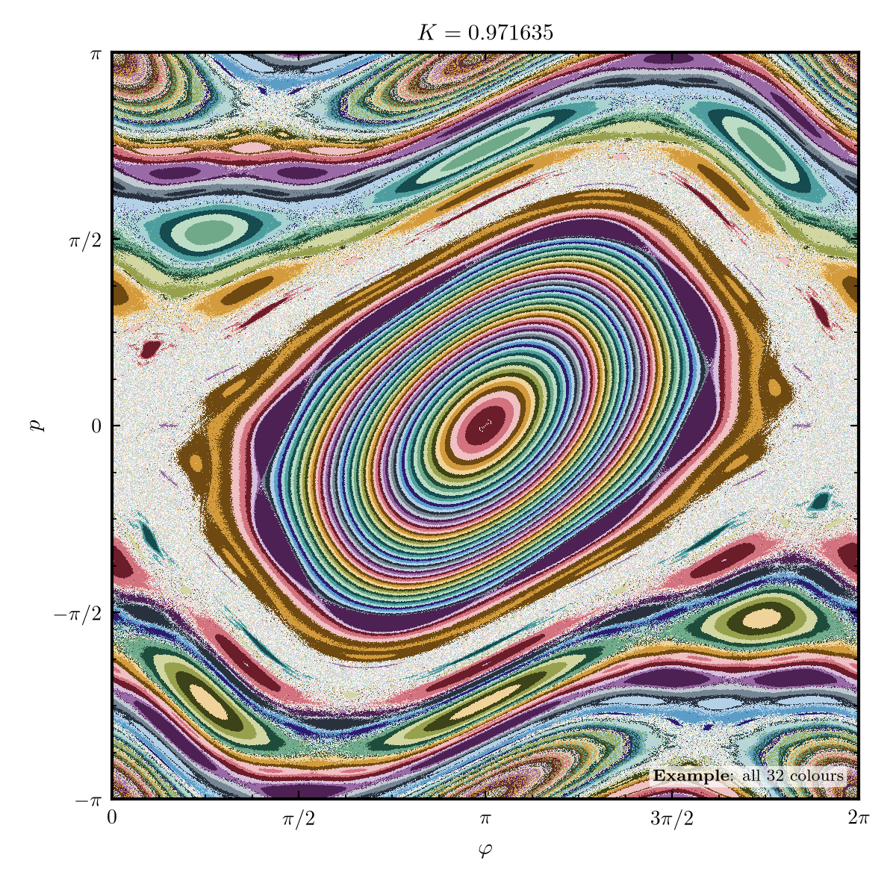
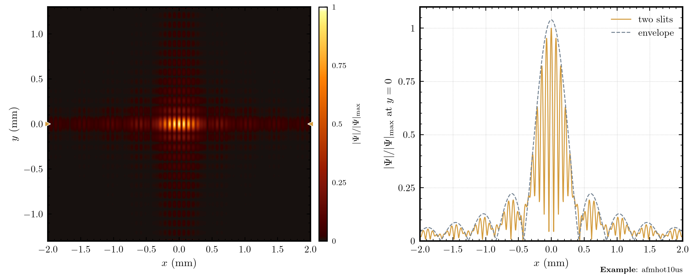
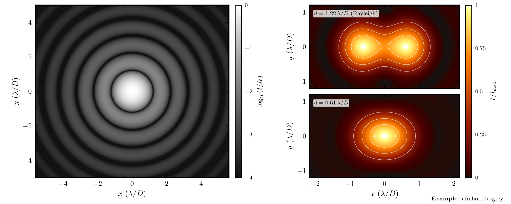

# The examples

The file `src/amore/examples.py` makes the nine figures in the README. To make them again, run `python -m amore.examples`. Each figure is a small example of the `amore` style, and each figure shows a different feature. Most data come from a formula or an equation. No data come from a measurement. The docstring of each function in `examples.py` gives the full sources and the reasons for the colours. The file `tests/test_examples_physics.py` checks the numbers of several figures.

## 1. Echoes from an exotic compact object

  

Function: `wave_packet()`. Figure: `amore_blue.png`.

The figure is a drawing of an idea, not the output of a simulation. It shows a made-up black hole ringdown signal and a weaker echo that follows it. An exotic compact object (ECO) can cause an echo if it has a reflecting surface in place of a horizon. Part of the wave goes back and forth between the surface and the potential barrier. A shaded band marks the prompt ringdown, and an inset and an arrow show a detail.

- Style: one palette (blue), a shaded band, an inset and an arrow.
- Reference: loosely after Fig. 9 of V. Cardoso and P. Pani, Living Rev. Relativ. 22, 4 (2019).

## 2. The Regge-Wheeler potential with a bump

  

Function: `potential_with_bump()`. Figure: `amore_teal.png`.

The Regge-Wheeler potential is the barrier that a gravitational perturbation sees around a Schwarzschild black hole. The figure plots it against the tortoise coordinate $r_{*}$, which goes to minus infinity at the horizon and to plus infinity far away. A small Pöschl-Teller or Gaussian bump, at a distance $a$ from the peak, changes the barrier. The dashed curve is the potential of null geodesics, scaled to the height of the barrier. Its peak is the photon sphere at $r = 3M$, and the Regge-Wheeler potential tends to it for large $\ell$.

- Style: the teal, amber and plum triad, a gradient fill and an inset with zoom lines.
- Reference: T. Regge and J. A. Wheeler, Phys. Rev. 108, 1063 (1957); S. Chandrasekhar, *The Mathematical Theory of Black Holes* (Oxford, 1983).
- Ringdown stability: K. Destounis and F. Duque, "Black-Hole Spectroscopy: Quasinormal Modes, Ringdown Stability and the Pseudospectrum", in *Compact Objects in the Universe*, eds. E. Papantonopoulos and N. Mavromatos (Springer, Cham, 2024), doi:10.1007/978-3-031-55098-0_6; R. F. Rosato, K. Destounis and P. Pani, "Ringdown stability: Graybody factors as stable gravitational-wave observables", Phys. Rev. D 110, L121501 (2024), arXiv:2406.01692.

## 3. Test charges near two extremal black holes

  

Function: `black_hole_charges()`. Figure: `amore_green.png`.

Two extremal black holes, with charge equal to mass, can stay at rest in equilibrium. Two positive and two negative test charges are near the holes. The figure shows the potential per unit test charge, with the lines of force on top. The dashed line is zero potential, and the cross is a point where the field is zero. The code uses new coefficients in place of Eq. (4.14) of Frolov and Zelnikov, and someone must check and verify them.

- Style: the diverging red and green map for a signed field, labelled contours and lines of force.
- Tests: Maxwell's equation, the flux through each hole and the new coefficients.
- Reference: V. P. Frolov and A. Zelnikov, Phys. Rev. D 85, 064032 (2012).

## 4. The curvature of a Kerr black hole

  

Function: `kerr_curvature()`. Figure: `amore_parula.png`.

The Kretschmann scalar $K$ measures the curvature of spacetime, and the Kerr solution gives it in closed form. The figure shows $\log_{10}|K|$ in a meridional plane, for the spin $a = 0.9\,M$. $K$ becomes infinite at the ring singularity and changes sign across the dashed curves. Pale red curves show the event horizon and the inner horizon. The colour shows a normalised logarithm, because $K$ covers six decades.

- Style: `fakeparulapastel` for a wide range, thin contour lines in the overlay grey, and an inset that has the same colour bar as the map.
- Reference: R. C. Henry, Astrophys. J. 535, 350 (2000), arXiv:astro-ph/9912320, with charge $Q = 0$.

## 5. A corner plot

  

Function: `corner_plot()`. Figure: `amore_corner.png`.

The figure is a corner plot of four synthetic parameters, which have no physical meaning. The 50 000 samples are a mixture of two Gaussians: 80 % at the origin and 20 % at a different position. Plum shows all the samples, and dashed olive lines show the second Gaussian alone. Teal lines mark the true mean of the second Gaussian, and amber lines mark the mean of all the samples. They are apart because the mean of a mixture is not at a peak.

- Style: four palettes for four roles: the data, a part of the data, and two reference values.
- Reference: D. Foreman-Mackey, J. Open Source Softw. 1, 24 (2016), doi:10.21105/joss.00024 (the "Customizing the plot" example of the corner.py documentation).

## 6. The Chirikov standard map

  

Function: `chirikov_square()`. Figure: `amore_chirikov_square.png`. The README shows a narrow strip of the same map, made by `chirikov_map()`.

The standard map is $p' = p + K \sin\varphi$ and $\varphi' = \varphi + p'$, both modulo $2\pi$. It is a simple map in which the motion changes from regular to chaotic as $K$ grows. $K = 0.971635$ is Greene's value, rounded, for the break-up of the last invariant curve, the golden-mean curve. The figure shows the whole phase space, with 300 × 300 starting points and 1000 steps each. The bands are invariant curves, the speckled region is the chaotic sea, and the colours have no meaning.

- Style: all 32 colours, and the one example that has more than four hues.
- Tests: area conservation, repeatability and the colours.
- Reference: B. V. Chirikov, Phys. Rep. 52, 263 (1979); J. M. Greene, J. Math. Phys. 20, 1183 (1979).

## 7. The pendulum phase portrait

  

Function: `pendulum_portrait()`. Figure: `amore_pendulum.png`.

The figure is the phase portrait of the undamped pendulum, $x' = y$ and $y' = -\sin x$, with $g/L = 1$. Teal streamlines show the flow, which is the context, and red curves show the orbits, which are the subject. Closed curves around the stable points are librations, and curves that cross the figure from side to side are rotations. The separatrix between them has the energy $E = 1$. SciPy integrates the orbits with `solve_ivp` (DOP853) to $t = 45$.

- Style: a complementary pair (teal and red), a 10 × 2.5 in strip and arrowheads.
- Tests: energy conservation and the kind of each orbit.
- Reference: S. Sarkar, "Solving ODEs using ODEINT", blog post, 6 July 2026; S. H. Strogatz, *Nonlinear Dynamics and Chaos*.

## 8. A double slit

  

Function: `double_slit()`. Figure: `amore_diffraction.png`.

A plane wave goes through two slits and falls on a screen 5 m behind them. Each slit is 22 µm wide and 88 µm high, the centres are 128 µm apart, and the wavelength is 18.5 Å. One FFT calculates the Fresnel diffraction integral, which is a Fourier transform. The left panel shows the amplitude on the screen, and the right panel shows the cut along the axis, with an envelope. The envelope is twice the amplitude of one slit, and it is only approximate because each slit is off the axis.

- Style: `afmhot10us` for an image, two panels with a colour bar at the side, amber for the result and slate for the reference.
- Tests: energy, the single-slit sinc and the fringe spacing $\lambda z/D$.
- Reference: R. de la Fuente, "Solving the Diffraction Integral with the Fast Fourier Transform (FFT) and Python", rafael-fuente.github.io (2020); J. W. Goodman, *Introduction to Fourier Optics*, sec. 3.5.

## 9. Airy rings and the Rayleigh limit

  

Function: `airy_rings()`. Figure: `amore_airy.png`.

A point source seen through a circular aperture gives the Airy pattern: a bright disc with faint rings. The intensity is $I = I_0 \left(2J_1(x)/x\right)^2$, with $x = \pi\rho$, where $\rho$ is the angle in units of $\lambda/D$. The left panel shows the pattern on a logarithmic scale, in the grey map, with the first dark ring at $1.22\,\lambda/D$. The right panels show two equally bright point sources, $1.22\,\lambda/D$ apart (the Rayleigh limit) and $0.61\,\lambda/D$ apart. At $1.22\,\lambda/D$ the dip between the peaks is 73.5 % of the maximum, and at $0.61\,\lambda/D$ the sources merge.

- Style: `afmhot10usgrey` and `afmhot10us` in one figure, a logarithmic colour bar with a stated floor, and a left image that lines up with the figure of the double slit. White crosses mark the true source positions, and white contours mark 0.25, 0.5 and 0.75 of the peak.
- Tests: the zeros of $J_1$, 83.8 % of the energy inside the first dark ring, the FFT of a circular aperture and the Rayleigh dip.
- Reference: C. Hill, *Learning Scientific Programming with Python*, 2nd edition, problem P8.1.2, "The Airy disc" (scipython.com, CC BY 4.0); M. Born and E. Wolf, *Principles of Optics*.